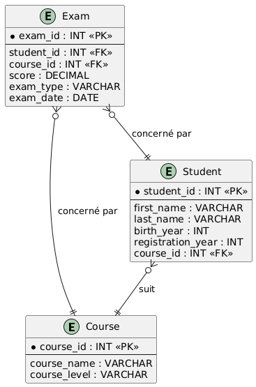

# 🧠 TP SQL – Étudiants, Formations & Examens

## 🎯 Objectif
S'exercer aux jointures SQL avec 3 tables liées entre elles.

---

## 🚀 Consignes pour démarrer

- **Forkez ce dépôt** sur votre compte GitHub avant de commencer le TP.  
- Clonez votre fork en local pour travailler dessus.

## 📝 Consignes pour le rendu

- Écrivez toutes vos réponses aux questions dans un **seul fichier SQL** `reponses.sql`.  
- Commentez clairement chaque requête avec le numéro de la question correspondante.  
- Testez vos requêtes avant de soumettre.  
- Une fois terminé, poussez votre fichier SQL sur le dépôt Git du TP.

---

## 📊 Organisation des tables

Les tables de cette base de données représentent trois entités principales :

- **Course** : liste des cours disponibles avec leur niveau.
- **Student** : liste des étudiants inscrits, chaque étudiant pouvant suivre un cours.
- **Exam** : résultats des examens passés par les étudiants, liés à un étudiant et un cours précis.

Chaque étudiant est lié à un seul cours via la clé étrangère `course_id` dans la table `Student`.

Chaque examen référence un étudiant (`student_id`) et un cours (`course_id`), permettant de suivre les résultats par cours et par étudiant.

---

### 🗂️ Diagramme du Modèle Logique des Données (MLD)

Vous pouvez consulter le diagramme du MLD pour mieux visualiser les relations entre les tables :

---

## 🔹 Partie 1 – INNER JOIN

1. Afficher le nom complet de l’étudiant et l’intitulé de sa formation.
2. Lister les étudiants inscrits en "Data Analyst".
3. Lister les examens avec le prénom, nom de l’étudiant, le nom du cours, la note et la date.

---

## 🔹 Partie 2 – LEFT JOIN

4. Afficher tous les étudiants avec leur formation, y compris ceux sans formation.
5. Afficher les étudiants sans formation (champ NULL).
6. Afficher tous les étudiants avec leurs examens, même s’ils n’en ont pas passé.

---

## 🔹 Partie 3 – RIGHT JOIN

7. Afficher toutes les formations même si aucun étudiant n'y est inscrit.
8. Afficher les examens associés à un cours, y compris les cours sans examens (si possible).

---

## 🔹 Partie 4 – FULL OUTER JOIN

9. Lister toutes les combinaisons étudiant-formation même sans correspondance.
10. Lister tous les examens et étudiants, même si l'un des deux est manquant.

---

## 🔹 Partie 5 – SELF JOIN

11. Trouver les paires d’étudiants nés la même année.
12. Associer chaque étudiant à ceux qui sont plus âgés qu’eux.

---

## 🔹 Partie 6 – CROSS JOIN

13. Générer toutes les combinaisons possibles entre étudiants et types d’examen ('Écrit', 'Oral', 'Projet').
14. Compter le nombre de lignes produites par ce CROSS JOIN.

---

## 🔹 Partie 7 – Aggrégations

15. Afficher la moyenne des notes par étudiant.
16. Afficher la note maximale obtenue par cours.
17. Lister les étudiants ayant obtenu une note supérieure à 15 à au moins un examen.

---

